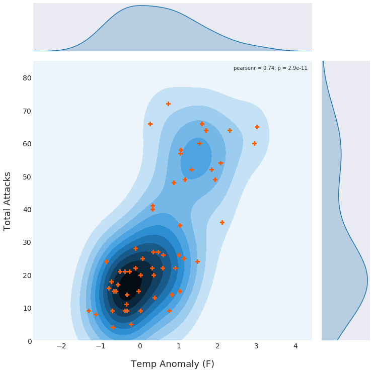

# US Shark Attacks, Land Temperature Anomalies, and Population Sizes.
Python project examining the relationship between shark attacks, population size, and temperature changes in the United States from 1960-2017.

# Content
### [Data Preproccessing + EDA](https://github.com/adambens/US_Shark_Attacks_Analysis/blob/master/Data%20Cleaning%20%2B%20Exploratory%20Analysis.ipynb)
Retreiving and cleaning data from three sources to combine into one pandas DataFrame for statistical analyses. 

### [Statistical Analysis](https://github.com/adambens/US_Shark_Attacks_Analysis/blob/master/Statistical%20Analysis.ipynb)
Performing statistical analyses on the data to determine relationships between the number of shark attacks, total population size, and land temperature anomalies.

